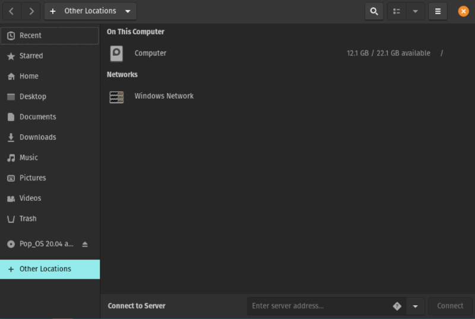

# ansible-ubuntu-laptop

Use Ansible to install and configure software on a laptop running Ubuntu.

## Quick Start

### Install Ansible

Instructions from the official Ansible docs for
[installing on Ubuntu](https://docs.ansible.com/ansible/latest/installation_guide/intro_installation.html#installing-ansible-on-ubuntu):

```
sudo apt update
sudo apt install software-properties-common
sudo apt-add-repository --yes --update ppa:ansible/ansible
sudo apt install ansible
```

### Clone this Repo

```
git clone git@github.com:nihiliad/ansible-ubuntu-laptop.git
```

### Run

```
cd ansible-ubuntu-laptop
ansible-playbook --ask-become-pass local.yml
```

## Testing with GNOME Boxes

### Host OS

#### Install Boxes

```
apt install gnome-boxes
```

#### Create a new vritual machine

Run Boxes and create a new virtual machine, probably by choosing "Operating System Image
File" under "Select an OS Source", to use a previously downloaded ISO file. Accept the
defaults (but maybe increase the memory), then Boxes will start a new virtual machine,
running the installer for the [Guest OS](#guest-os).

### Guest OS

#### Install the guest OS

Follow the prompts in the installer.

**Waring!** Do _not_ encrypt the drive for the host OS! This has made several virtual
machines, including Pop!_OS 20.04 and 21.10, impossible to shut down and restart with Boxes.

#### Share this repo folder in the guest OS

Open Files (Nautilus), and select "+ Other Locations". Under "Networks", there should be
no "Spice client folder":

 

Install packages to allow running the code in this repo via a shared folder, then reboot:

```
sudo apt install spice-vdagent spice-webdavd
sudo shutdown -r now
```

Again open Files (Nautilus), and select "+ Other Locations". Under "Networks", now there
should be a "Spice client folder":

 

In the Boxes menu, go to the "Properties" for this virtual machine, and select the
"Devices & Shares" tab. Under "Folder Shares", click "+" to add a new share. In the form
that pops up, navigate to this "Local Folder" on the host OS, click "Open", give the
folder a "Name" on the guest OS, then click "Save". 

Back in Files, click "Spice client folder". Another "Spice client folder" item should
appear above it, with a file folder icon next to it:

 

Click on the new item, which should display a folder icon with the name that you assigned
to the shared folder on the guest OS. Right click on that folder, and choose "Open in
Terminal". That should open a Terminal window for this repository's folder. The parent path
should be something like:

```
/run/user/1000/gvfs/dav+sd\:host\=Spice%2520client%2520folder._webdav._tcp.local/
```

#### Install credentials for GitHub

Copy credentials, probably public-private keys, for GitHub, from the host OS to the guest OS.

#### Remove the shared folder

The shared folder seems to cause Boxes to slow way down and eventually lock up. Remove it as
soon as possible after GitHub credentials are installed.

#### Test this code!

Follow the [Quick Start](#quick-start) procedure in the guest OS, and do all work there.
Helps to take snapshots of intermediate states, test, restore, and iterate. Note that Boxes
doesn't seem to allow naming snapshots
until after they are created.
